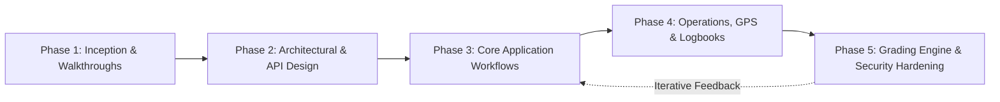
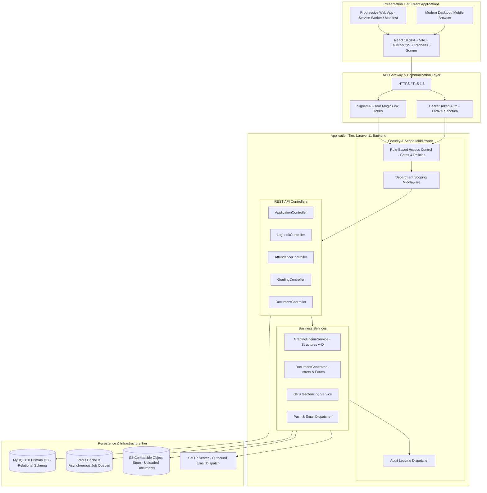
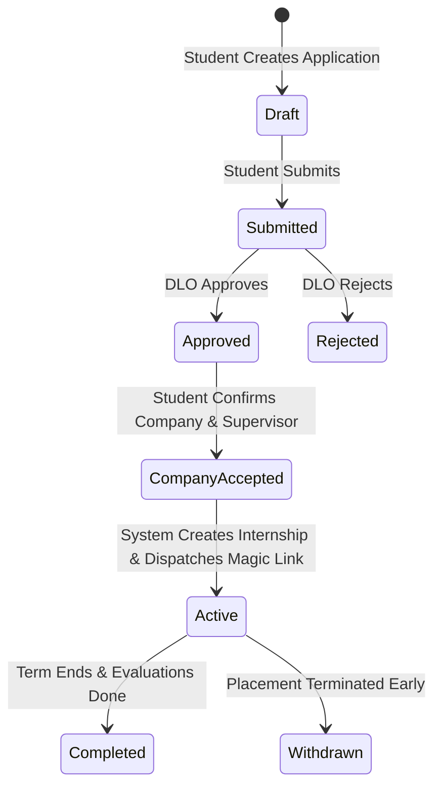

# Design and Development of an Internship Management System for HTU

**Department of Computer Science, Ho Technical University, Ho, Volta Region, Ghana**

### Team Members
- **Daniel Gbegbeawu** — 0322080457
- **Gohoho Shanita Eyram** — 0322080294
- **Gabriel Demordzie Asampana** — 0322080295
- **Emmanuel Adedoyin Ajao** — 0322080236
- **Edzia Emmanuel Kafui Korshie** — 0322080275
- **Sadick Issaka** — 0322080383

---

## Table of Contents

- [Chapter One: Introduction](#chapter-one-introduction)
  - [1.1 Background of the Project](#11-background-of-the-project)
  - [1.2 Statement of the Problem](#12-statement-of-the-problem)
  - [1.3 Aim and Objectives of the Project](#13-aim-and-objectives-of-the-project)
  - [1.4 Significance of the Study](#14-significance-of-the-study)
  - [1.5 Scope of the Study](#15-scope-of-the-study)
  - [1.6 Limitations of the Study](#16-limitations-of-the-study)
  - [1.7 Organization of the Report](#17-organization-of-the-report)
- [Chapter Two: Literature Review](#chapter-two-literature-review)
  - [2.1 Introduction](#21-introduction)
  - [2.2 Industrial Attachment and Work-Integrated Learning](#22-industrial-attachment-and-work-integrated-learning)
  - [2.3 The Ghanaian and Sub-Saharan African Context](#23-the-ghanaian-and-sub-saharan-african-context)
  - [2.4 Digital Transformation in African Higher Education](#24-digital-transformation-in-african-higher-education)
  - [2.5 Existing Internship Management Systems](#25-existing-internship-management-systems)
  - [2.6 Key Technical Concepts](#26-key-technical-concepts)
  - [2.7 Synthesis and Identified Gap](#27-synthesis-and-identified-gap)
- [Chapter Three: System Analysis and Design](#chapter-three-system-analysis-and-design)
  - [3.1 Introduction](#31-introduction)
  - [3.2 Development Methodology](#32-development-methodology)
    - [3.2.1 Iterative Development Lifecycle](#321-iterative-development-lifecycle)
    - [3.2.2 Phase Breakdown & Stakeholder Engagement](#322-phase-breakdown--stakeholder-engagement)
  - [3.3 Requirements Elicitation](#33-requirements-elicitation)
    - [3.3.1 Functional Requirements](#331-functional-requirements)
    - [3.3.2 Non-Functional Requirements](#332-non-functional-requirements)
    - [3.3.3 Resolved Grading Policy](#333-resolved-grading-policy)
  - [3.4 Use-Case Analysis](#34-use-case-analysis)
    - [3.4.1 User Roles and Actor Relationships](#341-user-roles-and-actor-relationships)
    - [3.4.2 Use Case Diagram](#342-use-case-diagram)
    - [3.4.3 Core Use Cases](#343-core-use-cases)
  - [3.5 System Architecture](#35-system-architecture)
    - [3.5.1 Architectural Pattern & System Architecture Diagram](#351-architectural-pattern--system-architecture-diagram)
    - [3.5.2 Technology Stack](#352-technology-stack)
    - [3.5.3 Role-Based Access Control and Data Scoping](#353-role-based-access-control-and-data-scoping)
    - [3.5.4 Authentication Architecture](#354-authentication-architecture)
    - [3.5.5 Key API Endpoints](#355-key-api-endpoints)
    - [3.5.6 Database Design](#356-database-design)
  - [3.6 Application and Grade State Machines](#36-application-and-grade-state-machines)
  - [3.7 Grading Engine Design](#37-grading-engine-design)
    - [3.7.1 Configurable Grading Structures](#371-configurable-grading-structures)
    - [3.7.2 Component Scoring](#372-component-scoring)
    - [3.7.3 Compilation Formula](#373-compilation-formula)
    - [3.7.4 Letter Grade and GPA Mapping](#374-letter-grade-and-gpa-mapping)
    - [3.7.5 Compilation and Publication Workflow](#375-compilation-and-publication-workflow)
  - [3.8 Security, Authorisation, and Audit Design](#38-security-authorisation-and-audit-design)
- [Chapter Four: Implementation and Testing](#chapter-four-implementation-and-testing)
  - [4.1 Introduction](#41-introduction)
  - [4.2 Development Approach](#42-development-approach)
  - [4.3 Frontend Implementation](#43-frontend-implementation)
    - [4.3.1 Screenshots of Key System Interfaces](#431-screenshots-of-key-system-interfaces)
  - [4.4 Backend Implementation](#44-backend-implementation)
  - [4.5 Grading Engine Implementation](#45-grading-engine-implementation)
  - [4.6 Key Workflows Implemented](#46-key-workflows-implemented)
    - [4.6.1 Workflow 1: Term Setup and Grading Structure Configuration & Locking](#461-workflow-1-term-setup-and-grading-structure-configuration--locking)
    - [4.6.2 Workflow 2: Student Application, Approval, and Placement Confirmation](#462-workflow-2-student-application-approval-and-placement-confirmation)
    - [4.6.3 Workflow 3: Daily GPS Attendance and Weekly Formative Operations](#463-workflow-3-daily-gps-attendance-and-weekly-formative-operations)
    - [4.6.4 Workflow 4: Academic Site Visitation & Field Supervision](#464-workflow-4-academic-site-visitation--field-supervision)
    - [4.6.5 Workflow 5: End-of-Attachment Summative Assessment & Grade Publication](#465-workflow-5-end-of-attachment-summative-assessment--grade-publication)
  - [4.7 Functional Testing Strategy & Test Case Results](#47-functional-testing-strategy--test-case-results)
    - [4.7.1 Unit & Component Testing](#471-unit--component-testing)
    - [4.7.2 Comprehensive Functional Test Cases & Results](#472-comprehensive-functional-test-cases--results)
  - [4.8 Security Testing](#48-security-testing)
    - [4.8.1 Security Evaluation Methodology](#481-security-evaluation-methodology)
    - [4.8.2 Security Test Cases & Verification Results](#482-security-test-cases--verification-results)
  - [4.9 Acceptance Criteria Verification](#49-acceptance-criteria-verification)
  - [4.10 Summary](#410-summary)
- [Chapter Five: Discussion, Conclusion, and Future Work](#chapter-five-discussion-conclusion-and-future-work)
  - [5.1 Introduction](#51-introduction)
  - [5.2 Discussion of Findings](#52-discussion-of-findings)
  - [5.3 Contribution of the Study](#53-contribution-of-the-study)
  - [5.4 Limitations](#54-limitations)
  - [5.5 Recommendations and Future Work](#55-recommendations-and-future-work)
  - [5.6 Conclusion](#56-conclusion)
- [References](#references)

---

# CHAPTER ONE: INTRODUCTION

## 1.1 Background of the Project
Industrial attachment, also known as industrial training, work-integrated learning, or internship, is a structured period during which students leave the lecture hall and apply their academic learning in a real workplace. In Ghana’s technical universities it is a graduation requirement, not an optional add-on. Students at Ho Technical University (HTU), like their counterparts at Takoradi, Kumasi, Sunyani, Accra, and other technical universities, must complete a defined period of attachment before they can be awarded their degree.

The reasoning behind this requirement is neither new nor controversial. Kolb’s (1984) experiential learning theory argues that knowledge is created through the transformation of experience, with the learner moving cyclically through concrete experience, reflective observation, abstract conceptualization, and active experimentation. An internship places the student inside that cycle for an extended period and at a level of intensity that classroom exercises cannot match (Stirling et al., 2014). Empirically, students who complete a meaningful work placement during their studies tend to enter the labor market more easily than those who do not. A recent tracer study of Technical and Vocational Education and Training (TVET) graduates across Ghana confirmed that those who undertook industrial attachment during their programme had measurably better employment outcomes than peers who did not (Ababio et al., 2024). At Sunyani Technical University, Aboagye and Puoza (2021) reached a similar conclusion in their study of mechanical engineering graduates: practical exposure during the programme was one of the few variables consistently associated with employment shortly after graduation.

The challenge is not whether attachment matters. It is whether the process surrounding it works. At HTU, as at most Ghanaian technical universities, the attachment process is still managed largely on paper. A student secures a host company, often informally through family or church networks, or through the school’s list of registered companies, collects a printed placement letter from the liaison office, hand-delivers it, and returns later with a signed acceptance form. During the attachment, the student keeps a paper logbook that the industry supervisor signs each week. After the attachment, the student submits a written report, the academic supervisor visits the company once if scheduling allows, and grades are entered into a spreadsheet that eventually finds its way to the academic records office. While some digital elements have been introduced, each of these steps remains fragile, and together they produce delays, lost documents, inconsistent assessment, and limited visibility for the people responsible for ensuring the attachment delivers on its training purpose.

Sarpong-Nyantakyi and Mensah (2025), studying Higher National Diploma graphic design students at Takoradi Technical University, identified a familiar pattern of complaints: thin supervision during the attachment, weak communication between the university and the host company, and assessment processes that depend almost entirely on a single late-stage report. They argued that without a more structured and better-supported framework, the attachment programme cannot deliver on its employability promise. The Ababio et al. (2024) tracer study reached a complementary conclusion at the institutional level. Even where attachment is associated with better employment outcomes on average, a non-trivial fraction of graduates emerges feeling that the experience was treated as an administrative formality rather than as a serious component of their training.

Ghana is not unusual in this. Across sub-Saharan Africa, higher education institutions are working under pressure to digitize administrative and academic processes that until recently were paper-driven. The COVID-19 pandemic forced the conversation forward. Ghansah (2025), reporting on the University of Education, Winneba, describes how more than ninety thousand students were transitioned to a Moodle-based learning platform between 2020 and 2022, an effort that exposed both what is possible and what remains hard about technology adoption in Ghanaian universities. The familiar barriers—uneven infrastructure, limited budgets, shortages of digital skills among staff, and a tendency to digitize the surface of a process while leaving the underlying paper workflow intact—were all visible in that case study. Where digital transformation has succeeded, it has typically done so through purpose-built systems designed around the institution’s actual workflow rather than through generic platforms imported wholesale.

That observation matters for the present study. Internship management is a workflow with several actors, several stages, and several documents that must move between them in a defined sequence. It is precisely the kind of process for which a well-designed information system can produce large gains. International examples support the case. As far back as 2004, Dharod (2004) demonstrated at California State University, San Bernardino, that a web-based internship coordination tool could replace much of the manual document handling in a university’s internship programme. More recently, and much more relevantly, the university directorate developed a web-based Internship Management System specifically for Ho Technical University. Built on Laravel for the backend and Vue.js for the frontend, that system replaced the paper logbook with a digital one and enabled real-time supervisor feedback. This initiative shows that there is institutional appetite at HTU for digital reform of the attachment process, and that a meaningful baseline now exists.

The system described in this report builds on that university-led direction but goes considerably further. Where the previous initiative focused mainly on digitizing the logbook and generating placement letters, the system proposed here covers the full lifecycle of an attachment — from the student’s initial application through company approval, document generation, supervisor assignment, daily attendance, weekly assessment, mid-term and final evaluation, grading, and term archiving. It serves six distinct user roles with different permissions: the Central Liaison Office, Departmental Liaisons, Students, Academic Supervisors, Industry Supervisors, and Heads of Department. It introduces a multi-source grading engine and GPS-based attendance verification, an element absent from the earlier university prototype.

## 1.2 Statement of the Problem
The current industrial attachment process at Ho Technical University is paper-driven, fragmented, and difficult to monitor. Five specific weaknesses recur in conversations with students, liaison officers, and academic supervisors:

1. **Manual Placement Letters and Forms**: Placement letters and acceptance forms are produced manually. A student visits the liaison office, the secretary types or hand-fills a letterhead document, and the student carries it to the host company. When errors occur (a misspelled company name, a wrong start date, a missing supervisor signature), the student must return to the office and start again. The cycle wastes time on both sides, and the version of the document held by the university often differs from the version held by the company.
2. **Fragile Paper Logbooks**: The logbook is a paper notebook the student carries to the workplace. It is signed weekly by the industry supervisor and reviewed by the academic supervisor at most once during the attachment. Logbooks get lost, get water-damaged, or arrive at the end of the term so cluttered with retroactive entries that they cannot serve as reliable evidence of what the student actually did. There is no way for the academic supervisor to monitor activity in real time, and so by the time a problem is detected (a student who has stopped going to work, or tasks bearing no relation to their programme of study), it is usually too late to intervene.
3. **Unverifiable Attendance**: Attendance is taken on the student’s word. The institution has no independent way to verify that a student was at the host company on a given day. This is a particular concern given the geographical spread of host companies, which range across the Volta region and beyond, and the practical impossibility of routine site visits.
4. **Compressed, Delayed Evaluations**: Evaluation is concentrated at the end of the attachment and depends almost entirely on a single industry supervisor’s recall. The mid-term evaluation, where it happens at all, is a phone call. The final evaluation form is sometimes returned weeks late and sometimes never returned, leaving the academic supervisor to grade on the basis of a written report alone. This compresses the assessment to a narrow window and produces grades that are weakly correlated with what the student actually demonstrated during the attachment.
5. **Reactive Oversight**: Oversight at the departmental and central level is reactive rather than proactive. The Central Liaison Office has no real-time view of how many students are on attachment, how many companies are approved or pending, how many evaluations are outstanding, or where in the process the system is bottlenecked. Departmental liaisons rely on phone calls and physical visits to track their students. The result is that interventions happen after the fact, escalations get lost in email threads, and end-of-term reporting is a manual reconstruction from incomplete records.

Ankah’s (2025) HTU prototype begins to address some of these issues—the digital logbook and the automated placement letter in particular. What is still missing, and what this project sets out to provide, is a single system that covers all six roles involved in the process, integrates GPS-verified attendance, supports a structured multi-source grading workflow, and produces archivable records that satisfy both the academic-records department and accreditation review.

## 1.3 Aim and Objectives of the Project

### Aim
The aim of this study is to design, develop, and evaluate a web-based Industrial Attachment Management System (IAMS) for Ho Technical University that digitises the full attachment lifecycle and supports the six categories of users involved in it.

### Objectives
The aim above is broken into five specific objectives:
1. To investigate the current problems of the attachment process at HTU and identify the workflow gaps that a digital system should address.
2. To design a role-based system architecture supporting the Central Liaison Office, Departmental Liaisons, Students, Academic Supervisors, Industry Supervisors, and Heads of Department, with appropriate permissions for each.
3. To implement a digital logbook with GPS-verified daily attendance, automated placement-letter generation, and a structured multi-source grading engine.
4. To test the system against a defined set of acceptance criteria covering authentication, application workflow, document generation, attendance, evaluation, and archiving.
5. To evaluate the system’s usability with a representative group of students and liaison staff, and to document recommendations for institutional rollout.

## 1.4 Significance of the Study
The study is significant on three counts:
- **For HTU Itself**: A working system that covers all six attachment roles offers a direct route to a more transparent, less paper-dependent process. Liaison staff gain real-time visibility, students gain a single platform for everything they currently chase by email and in person, and the central administration gains the institutional reporting needed for accreditation reviews. The system also addresses the university's strategic commitment to digital transformation and its obligations under accreditation standards that require systematic documentation and oversight of work-integrated learning activities. Furthermore, it supports the kind of industry–academia collaboration that the university has publicly committed to.
- **For Other Ghanaian Technical Universities**: The study offers a worked example of what a context-aware, locally built attachment platform looks like. Generic international software is available, but it is priced for North American institutions and is not designed around the specific roles, document templates, and grading conventions of a Ghanaian technical university. Ghansah’s (2025) account of digital transformation at the University of Education, Winneba, suggests that locally adapted systems integrate more smoothly than imported ones, and that institutional fit matters at least as much as feature richness when adoption is the goal. A locally developed alternative, with its requirements drawn from a Ghanaian institution’s actual workflow, is therefore more likely to be adopted across the system.
- **For Higher Education Digital Transformation Literature**: The study contributes a concrete case study at the level of a single administrative process. Most published work on the topic operates at the strategic or institutional level. The detailed working out of one process, its requirements, its actors, its grading rules, and its archival lifecycle is a useful complement to that strategic literature, directly extending prior institutional development efforts at HTU.

## 1.5 Scope of the Study
The study is scoped tightly to the industrial attachment process at Ho Technical University. The system supports the six user roles defined above and covers the full lifecycle from application to term archiving across 153 functional features grouped into nine sections: authentication and user management, central liaison features, departmental liaison features, student features, academic supervisor features, industry supervisor features, head of department features, system-wide cross-cutting features, and a small set of items deliberately left for institutional clarification before implementation.

The system is built as a web application accessible through any modern browser, with a progressive web app (PWA) layer for mobile use. The technology stack consists of **Laravel 11 (PHP 8.3)** on the backend, a **React 18 single-page application (bundled with Vite and styled with TailwindCSS)** on the frontend, **MySQL** as the primary datastore, **Redis** for caching and sessions, and an **S3-compatible object store** for files. Authentication uses Google Single Sign-On restricted to the `@htu.edu.gh` domain for university users, and signed magic-link URLs for industry supervisors, who are not expected to maintain Google accounts.

The study does not extend to native mobile applications, to the integration of attachment data with the wider HTU enterprise resource planning system beyond academic-records grade export, or to longitudinal study of graduate employment outcomes. It also does not cover other forms of work-integrated learning offered at HTU, such as field trips, sandwich courses, or short professional placements; these may share infrastructure but operate on different timelines and assessment rules.

## 1.6 Limitations of the Study
Three limitations are acknowledged:
1. The system was designed and tested with a single institution’s workflow in mind. Generalization to other Ghanaian technical universities is plausible but would require local re-validation, particularly of grading rules and document templates.
2. GPS-based attendance verification depends on the student’s mobile device and on signal availability at the host company. The system supports a manual check-in fallback with industry-supervisor verification, but in workplaces where neither GPS nor the supervisor’s prompt response is reliable, attendance data will be weaker than the system’s design assumes.
3. The evaluation phase of the study covers usability and functional acceptance, not long-term outcomes. Whether the system actually improves graduate employability—the deeper question motivating the attachment programme—would require a tracer study several years after deployment, which is outside the scope of an undergraduate project.

## 1.7 Organization of the Report
This report is organized into five chapters:
- **Chapter One** has introduced the problem, set out the aim and objectives, and defined the scope and limitations of the work.
- **Chapter Two** reviews the literature on industrial attachment, work-integrated learning, and the digitization of internship management in higher education, with particular attention to studies in Ghana and the wider African context.
- **Chapter Three** describes the methodology adopted: the requirements-gathering approach, the architectural design of the system, the data model, and the technology choices.
- **Chapter Four** reports the implementation and testing of the system, including the principal modules, the acceptance criteria checked, and screenshots of the working system.
- **Chapter Five** discusses the findings, draws conclusions about the contribution made, and identifies directions for future work, including extension to other technical universities and longer-term evaluation of the system’s effect on the attachment.

---

# CHAPTER TWO: LITERATURE REVIEW

## 2.1 Introduction
Three bodies of literature converge on the problem this project addresses. The first is the pedagogical literature on experiential and work-integrated learning, which explains why industrial attachment is compulsory in Ghana's technical universities and what conditions make it effective. The second is the African higher education literature, which documents the gap between the educational ambitions of the attachment programme and the administrative reality of how it is managed. The third is the technical literature on internship management systems, which offers a growing catalogue of partial solutions from which the present design both draws and departs. Taken together, these three bodies of work point to a specific gap in coverage, which this chapter makes explicit before Chapter Three describes how the design responds to it.

## 2.2 Industrial Attachment and Work-Integrated Learning
Kolb's (1984) experiential learning theory provides the most widely cited framework for understanding why workplace-based learning matters. Learning, Kolb argues, is a four-stage cycle: concrete experience, reflective observation, abstract conceptualisation, and active experimentation. Classroom instruction can briefly invoke this cycle, but it rarely sustains it long enough for deep competence to develop. A workplace placement sustains the cycle for weeks or months, in a setting where decisions carry real consequences and guidance comes from practitioners rather than lecturers. Stirling et al. (2014), reviewing internships across Ontario colleges and universities, mapped four hundred and twelve programmes against Kolb's framework and found that the most successful provided structured opportunities for reflection alongside the concrete work, confirming that the experience alone is necessary but not sufficient.

Recent African empirical work builds a strong case that when attachment is properly managed it delivers measurable employment benefits. Ababio et al. (2024), in a Ghana-wide tracer study of TVET graduates, found that those who completed structured industrial attachment had markedly higher employment rates within a year of graduation than those whose attachment had been disrupted or only nominally completed. At Sunyani Technical University, Aboagye and Puoza (2021) found that the quality of practical exposure during a mechanical engineering programme was more consistently linked to post-graduation employment than either academic grade or course composition. Adegbite and Hoole (2024), using structural equation modelling across Nigerian universities, found that work-integrated learning had a statistically significant positive effect on the softer competencies (communication, teamwork, and time management) that employers routinely rank above academic credentials.

These findings, however, are about attachment when it works. The same body of literature documents what happens when it does not. Sarpong-Nyantakyi and Mensah (2025), studying graphic design students at Takoradi Technical University, found that a sizeable minority of respondents experienced the attachment as a poorly supervised period of marginal tasks unrelated to their training. Ngonda, Nkhoma, and Falayi (2024), comparing engineering placements at three universities in Malawi, Namibia, and South Africa, found wide variation in placement structure, supervision depth, and assessment instruments, and concluded that this variation rather than placement existence per se accounted for much of the spread in student outcomes. The implication — directly relevant to the present project — is that the administrative and supervisory process around the attachment matters at least as much as the attachment itself.

## 2.3 The Ghanaian and Sub-Saharan African Context
Industrial attachment in Ghana is governed by the Technical and Vocational Education and Training (TVET) framework that applies to all technical universities in the country. Every accredited programme includes a mandatory attachment period, typically scheduled during a long vacation between academic levels. Administrative responsibility sits with a Central Liaison Office at the institutional level, supported by Departmental Liaisons within each faculty, the same structure that the IAMS is designed to serve.

Published accounts of how this structure operates in practice are remarkably consistent. Sarpong-Nyantakyi and Mensah (2025) describe placement letters typed one at a time in the liaison office, students left largely responsible for sourcing their own companies, and supervision concentrated in a single late-stage academic visit. The absence of a centralised digital workflow, they argue, directly produces the supervision gaps students report. Ababio et al. (2024) reach the same conclusion at the institutional level, calling for investment in digital infrastructure to support the attachment programme rather than continued reliance on ad hoc paper processes.

Nigeria and southern Africa show the same pattern. Adegbite and Hoole (2024) identify analogous bottlenecks in Nigerian placement coordination; Ngonda et al. (2024) document the administrative variation across Malawi, Namibia, and South Africa as a persistent structural problem. What unites these accounts is a single observation: African TVET institutions are running attachment programmes whose pedagogical ambitions consistently exceed the administrative infrastructure supporting them. A digital management system is well placed to close that gap.

## 2.4 Digital Transformation in African Higher Education
Pressure to digitise academic and administrative processes in African higher education has intensified sharply since COVID-19 forced the issue. Ghansah (2025) provides the most detailed recent Ghanaian case study, reporting on the University of Education, Winneba's rapid migration of more than ninety thousand students to a Moodle-based platform during the 2020 lockdown. The successes are real: academic continuity was maintained, record-keeping improved, and a foundation for hybrid delivery was established. But the barriers Ghansah (2025) identifies are equally instructive: uneven internet access in rural areas, limited digital literacy among staff and students, a shortage of institutional ICT policy, and, most relevant here, a tendency to map paper workflows onto digital tools without rethinking the underlying process. Moving a logbook into a Google Sheet is not digital transformation; it is digitisation of a broken workflow.

Assalaarachchi et al. (2025), working in Sri Lanka, make the same point with precision. Digital transformation in higher education succeeds when the design begins with the actual workflow that needs to change, not with a generic platform that is then configured around the edges. At the University of Sri Jayewardenepura, off-the-shelf SaaS tools could not accommodate the institution's specific approval chains, evaluation rules, and document templates; a purpose-built system was the only credible path. Barrocan et al. (2025) reinforce this conclusion at Pangasinan State University in the Philippines, where a Laravel-based system built against the institution's own programme requirements achieved improvements that a generic tool would not have reached.

For the IAMS, the implication is clear. The system must be designed around HTU's specific roles, document conventions, grading rules, and term lifecycle, not adapted from a platform designed for a different institutional context.

## 2.5 Existing Internship Management Systems
Published work on internship management systems over the last few years falls into two broad groups: technical implementation studies that report specific systems built for specific institutions, and broader systems-level analyses of the digitisation challenge. Both groups are useful, and the accumulated evidence is now large enough to identify consistent patterns in what existing systems provide and what they leave out.

Ankah (2025) provides the most directly relevant precedent. His web-based Internship Management System for Ho Technical University, built on Laravel and Vue.js, piloted with final-year Computer Science students, replaced the paper logbook with a digital one, automated placement letter generation from a configurable template, and enabled real-time supervisor feedback on student entries. Its significance for this project is twofold: it establishes that the basic technology stack works at HTU, and it demonstrates that students, academic supervisors, and industry supervisors at this institution can engage with a digital system without unusual resistance. Its limitation is equally clear: the lifecycle around the logbook (application and company approval, academic supervisor assignment, GPS-verified attendance, multi-source grade compilation, and term archiving) falls outside its scope.

Assalaarachchi et al. (2025) report on ISES, a comparable system built at the University of Sri Jayewardenepura in Sri Lanka using HTML and PHP. Validated through two rounds of stakeholder interviews, the system addressed three specific pain points: the burden of paper document management, the inconvenience of repeated campus visits by interns for document submission, and the absence of a unified communication channel. Three findings from their study translate directly to the HTU context. First, the manual process they documented before building ISES was substantially the same as the one currently in use at HTU: paper logbooks, infrequent supervisor visits, and late-stage written reports, confirming that this is a structural rather than institution-specific problem. Second, stakeholders rated the absence of a centralised communication channel as more disruptive than the absence of digital documents, pointing to the need for in-system messaging from the outset. Third, a single development cycle was sufficient to eliminate most of the documented limitations, which is an encouraging benchmark for a project of similar scope.

Barrocan et al. (2025), at Pangasinan State University in the Philippines, focused specifically on attendance tracking. Their Laravel-based, Agile-developed system used a three-tier architecture to deliver real-time attendance logging, automated reporting, and structured progress monitoring. Evaluated across fifty respondents in usability testing, the system significantly reduced human error in attendance records. Two things make this study particularly relevant. First, it independently validates the Laravel and PHP stack as appropriate for internship management at single-faculty scale, the same conclusion Ankah (2025) reached at HTU. Second, it points directly toward the attendance problem as the weakest link in the paper process, which the present project extends by adding GPS verification to the check-in mechanism.

For historical perspective, Dharod (2004) demonstrated at California State University over two decades ago that a web-based coordination tool could eliminate the paper document-handling burden in a university internship programme. The technical environment has changed substantially since, but the argument has not.

Across this literature, common features emerge reliably: digital logbooks, automated document generation, multi-role authentication, and supervisor feedback channels. So do common gaps. None of the reviewed systems covers all six of the role categories that HTU's attachment process requires; most address three or four. None integrate GPS-verified check-in as a component of daily attendance. None implement a configurable multi-source grading engine that draws from the industry supervisor, academic supervisor, and departmental liaison according to institutional weighting rules. The IAMS proposed here is designed to address precisely these gaps.

## 2.6 Key Technical Concepts
Three technical decisions distinguish the IAMS from the systems reviewed above, not as arbitrary choices but as direct responses to identified failure modes in the manual process:
- **Role-Based Access Control (RBAC)** addresses the access problem. RBAC assigns permissions to roles rather than to individual users, so that access to any function is determined by the role a user occupies within the system. For a workflow involving six roles with overlapping but non-identical permissions (the Central Liaison Office can do things the Departmental Liaison cannot; the Industry Supervisor can see only their own students), RBAC is the natural model. Laravel's built-in authorisation primitives (Gates and Policies) implement RBAC natively, and the design exploits them throughout.
- **Geofenced GPS Verification** addresses the attendance problem. The paper process has no way to verify that a student attended the host company on a given day; the student's word is the only evidence. Geofencing establishes a virtual perimeter around the host company's location and records a check-in only when the student's device lies within it. This mechanism has been deployed at university campuses internationally for classroom attendance, and its logic applies directly to industrial placements. What is less common, and constitutes a design contribution of this project, is the adaptation of geofencing to a distributed setting where host company locations vary across students and change from term to term.
- **Progressive Web App (PWA) Delivery** addresses the connectivity and device problem. Native mobile applications require platform-specific builds for Android and iOS and impose an app-store installation step that adds friction and excludes users on constrained data plans. A progressive web app is a web application that meets a defined set of performance and capability standards (service worker support, a web manifest, HTTPS) and can therefore be added to a device's home screen, function offline in read mode, and receive push notifications. In the Volta region context, where data costs and device specifications vary considerably across the student population, a single PWA codebase that adapts to the device on which it runs is a more equitable delivery mechanism than a native app. This was the model selected for the mobile-facing components of the IAMS.

## 2.7 Synthesis and Identified Gap
Industrial attachment, when properly administered, demonstrably improves graduate employability in the African context — the evidence from Ghana, Nigeria, and southern Africa is consistent on this point. The problem is that administrative and supervisory processes at most African technical universities, HTU included, do not yet support attachment well. Paper-based workflows produce supervision gaps, attendance uncertainty, compressed and unreliable assessment, and reactive oversight. Purpose-built digital systems can close these gaps; Ankah (2025) at HTU, Assalaarachchi et al. (2025) in Sri Lanka, and Barrocan et al. (2025) in the Philippines all demonstrate that the engineering is tractable and that uptake is achievable within a single institution.

No published system covers the full picture. The previous HTU prototype covers the logbook and the placement letter. ISES covers supervision and evaluation at a department level. Barrocan et al.'s system covers attendance time-tracking. What none of them covers, and what this study delivers, is a single platform that manages the complete attachment lifecycle across all six roles, with GPS-verified daily attendance and a configurable multi-source grading engine, built specifically for a Ghanaian technical university context. Chapter Three describes the methodology through which that platform was built.

---

# CHAPTER THREE: SYSTEM ANALYSIS AND DESIGN

## 3.1 Introduction
This chapter documents the analysis of the existing attachment process at HTU and the design of the Industrial Attachment Management System (IAMS) built to replace it. It proceeds through development methodology, requirements elicitation, use-case analysis, system architecture, database design, state machines, and the grading engine. The grading engine receives dedicated treatment because it encodes the institution's assessment policy and is the most business-rule-intensive part of the system. All design decisions described here reflect the system as specified for production deployment (Version 2.0).

## 3.2 Development Methodology

### 3.2.1 Iterative Development Lifecycle
The development of the IAMS followed an **Iterative and Incremental Software Development Life Cycle (SDLC)** modeled on Agile Scrum principles. This approach was selected because the system bridges multiple disparate user groups (university administration, faculty liaisons, academic supervisors, workplace industry mentors, and students) whose functional expectations and technical constraints vary significantly.

Rather than adopting a rigid waterfall model, development was structured into five successive, demonstrable increments corresponding to the attachment lifecycle phases:
1. **Phase 1: Inception & Domain Analysis** (Requirements elicitation, stakeholder walkthroughs, grading policy consensus).
2. **Phase 2: Architectural & Schema Design** (Database normalization, RBAC policy modeling, API contract specification).
3. **Phase 3: Core Workflow Implementation** (Application management, automated document generation, company approval chains).
4. **Phase 4: Operational & Field Features** (GPS geofenced attendance, digital logbooks, weekly supervisory rubrics, site visit scoring).
5. **Phase 5: Grading Engine, Security Hardening & Acceptance Testing** (Normalisation/weighting engine, HOD approval locking, Vitest test suite, end-to-end verification).

### 3.2.2 Phase Breakdown & Stakeholder Engagement
- **Sprint Cycles**: Development proceeded in two-week sprint iterations. Each sprint began with sprint planning prioritizing user stories from the 153-feature backlog, followed by daily development against decoupled API contracts, and concluded with a sprint review and demo.
- **Continuous Stakeholder Validation**: Prototype builds were regularly demonstrated to representative stakeholders (including 5 Departmental Liaisons, 5 Central Liaison staff, and student cohorts) to validate UI/UX ergonomics, language appropriateness, and workflow compliance. Feedback directly led to high-impact improvements, such as the introduction of a passwordless 48-hour magic-link access workflow for external workplace supervisors and an HOD configuration locking step.
- **Continuous Integration & Quality Gates**: Code increments were gated through automated testing (Vitest unit tests for frontend calculation and component logic, PHPUnit/Laravel feature tests for API state transitions) and strict build verification (`npm run build`) before deployment to staging.

## 3.3 Requirements Elicitation
Requirements were gathered through three complementary methods: structured walkthroughs of the existing workflow with 15 participants (5 CLO staff, 5 DLOs, 5 students), semi-structured interviews with academic supervisors, and institutional document analysis (placement letters, evaluation forms, syllabi). These sessions produced a documented inventory of every step in the current process, the roles responsible, the documents exchanged, and the failure modes participants had personally experienced. The full 153-feature specification was then reviewed and validated against this record.

### 3.3.1 Functional Requirements
Across six user roles and nine feature sections, the 153 functional requirements are distributed as shown in Table 3.1.

**Table 3.1: Feature count by role and section**

| Role / Section | Feature Count |
| :--- | :--- |
| Authentication and User Management | 14 |
| Central Liaison Office | 32 |
| Departmental Liaison | 32 |
| Student | 27 |
| Academic Supervisor | 14 |
| Workplace Supervisor | 11 |
| Head of Department | 2 |
| System-Wide Cross-Cutting | 21 |
| **Total** | **153** |

### 3.3.2 Non-Functional Requirements
- **Performance & Concurrency**: Sustained sub-second API response times (< 800ms) under a peak concurrency of 2,000 simultaneous users during term opening and application submission windows.
- **Availability & Scalability**: 99.5% uptime during active attachment cycles, backed by stateless application servers, Redis-backed queues, and horizontally scalable relational storage.
- **Data Security & Privacy Compliance**: Full compliance with the Ghana Data Protection Act 2012. Strict tokenized authentication, multi-tenant department scoping, encrypted transit (TLS 1.3), hashed credentials, and tamper-evident audit logging.
- **Usability & Mobile Responsiveness**: Seamless Progressive Web App (PWA) execution on mobile devices down to 360px viewport width, low-bandwidth data optimization, and accessible touch controls for field check-ins.

### 3.3.3 Resolved Grading Policy
The grading policy question—how the final percentage is compiled from the available assessment sources—was the most consequential open decision facing the project. Rather than fixing a single formula, the confirmed design allows each department, through its Departmental Liaison, to select one of four grading structures and to set the component weights within the chosen structure, subject to approval and locking by the Head of Department before the term begins. Section 3.7 describes this design in full.

## 3.4 Use-Case Analysis

### 3.4.1 User Roles and Actor Relationships
Six actors interact with the system, each with a distinct scope of data visibility and a distinct set of capabilities. Table 3.2 summarises the role model.

**Table 3.2: User roles and responsibilities**

| Role | Scope | Key Responsibilities |
| :--- | :--- | :--- |
| **Student** | Own records only | Apply for attachment, log daily attendance, submit weekly logbooks, upload documents, view published final grades. |
| **Departmental Liaison (DLO)** | Department | Approve or reject applications, assign academic supervisors, configure the department's grading structure and weights, enter report and presentation scores, compile and publish final grades. |
| **Central Liaison Office (CLO)** | University-wide | Global system administration, department and user management, academic term control, company verification, full audit log access. |
| **Head of Department (HOD)** | Department | Review and approve departmental grading configurations, locking them for the active term; monitor departmental attachment statistics. |
| **Academic Supervisor** | Assigned students | Field visitation scoring against ten criteria, logbook review, observation notes. |
| **Workplace Supervisor** | Assigned interns | Weekly qualitative rubric scoring, final industrial assessment across eighteen criteria, logbook review; accesses the system via a 48-hour magic link rather than a university account. |

### 3.4.2 Use Case Diagram
Figure 3.0 illustrates the comprehensive Use Case diagram capturing the interactions between the six primary system actors and the core system boundaries of the IAMS.

```mermaid
flowchart TD
    subgraph Actors [System Actors]
        CLO[Central Liaison Office - CLO]
        DLO[Departmental Liaison - DLO]
        HOD[Head of Department - HOD]
        STU[Student]
        ASUP[Academic Supervisor]
        WSUP[Workplace Supervisor]
    end

    subgraph Administration [1. Administration & Configuration]
        UC01([Manage Terms & Global Settings])
        UC02([Verify & Register Companies])
        UC03([Configure Grading Structure & Weights])
        UC04([Review & Lock Grading Config])
        UC05([View System Audit Logs])
    end

    subgraph Placement [2. Placement & Workflow]
        UC06([Submit Attachment Application])
        UC07([Review & Approve Application])
        UC08([Submit Workplace Details & Accept])
        UC09([Generate Placement & Insurance Letters])
        UC10([Assign Academic Supervisors])
    end

    subgraph Operations [3. Daily & Weekly Operations]
        UC11([Log GPS Check-in Attendance])
        UC12([Submit Weekly Logbook Entry])
        UC13([Review & Sign Logbooks])
        UC14([Submit Weekly Qualitative Rubric])
        UC15([Conduct Site Visit & Record Score])
    end

    subgraph Grading [4. Evaluation & Grading Engine]
        UC16([Submit 18-Criteria Industrial Assessment])
        UC17([Enter Report & Presentation Scores])
        UC18([Trigger Multi-Source Grade Compilation])
        UC19([Approve & Publish Final Grades])
        UC20([View Published Grade Breakdown])
    end

    %% CLO Relationships
    CLO --> UC01
    CLO --> UC02
    CLO --> UC05

    %% DLO Relationships
    DLO --> UC03
    DLO --> UC07
    DLO --> UC09
    DLO --> UC10
    DLO --> UC13
    DLO --> UC17
    DLO --> UC18
    DLO --> UC19

    %% HOD Relationships
    HOD --> UC04

    %% Student Relationships
    STU --> UC06
    STU --> UC08
    STU --> UC11
    STU --> UC12
    STU --> UC20

    %% Workplace Supervisor Relationships
    WSUP --> UC13
    WSUP --> UC14
    WSUP --> UC16

    %% Academic Supervisor Relationships
    ASUP --> UC13
    ASUP --> UC15
```

*Figure 3.0: High-Level UML Use Case Diagram for the Industrial Attachment Management System (IAMS)*

### 3.4.3 Core Use Cases
- **UC-01 — Term and Grading Structure Setup**: The CLO initialises the academic term's start and end dates and approves the companies eligible to participate. The DLO then configures the department's grading structure, selecting one of four defined structures and setting the associated component weights, which the HOD reviews and approves, locking the configuration for the active term.
- **UC-02 — Application and Placement Confirmation**: A student creates an application in draft state, selecting a company and academic term, and submits it. The DLO reviews and approves the application, and the student then confirms placement by supplying the workplace supervisor's contact details. The system automatically creates an active internship record and emails a 48-hour magic link to the workplace supervisor.
- **UC-03 — Daily and Weekly Operations**: During the attachment, the student logs daily attendance and submits a weekly logbook summarising activity and reflection. The workplace supervisor rates the student's weekly progress against six qualitative criteria. The academic supervisor conducts one site visit during the term, records observation notes, and rates the visit against ten criteria.
- **UC-04 — End-of-Attachment Evaluation**: At the end of the attachment, the workplace supervisor completes the Industrial Assessment (eighteen criteria across four sections, each rated one to five), which the system computes to a percentage. The DLO separately enters the report score and, where the department's structure includes it, the presentation score.
- **UC-05 — Grade Compilation and Publication**: With all applicable components entered, the DLO compiles the grade. The backend engine normalises each component to a common 100-point scale, applies the department's structure weights, computes the total weighted score, and maps it to the HTU letter grade and GPA scale. The DLO reviews the calculated result, approves it, and publishes it, at which point, and not before, the student can view their official grade breakdown.

## 3.5 System Architecture

### 3.5.1 Architectural Pattern & System Architecture Diagram
IAMS follows a decoupled, three-tier full-stack architecture: a client-side **React 18 SPA / PWA**, an application-tier **Laravel 11 REST API**, and a robust persistence layer consisting of **MySQL 8.0, Redis, and Object Storage**.

Figure 3.1 illustrates the comprehensive multi-tier System Architecture.

*Figure 3.1: Multi-Tier System Architecture of the Industrial Attachment Management System*

### 3.5.2 Technology Stack
- **Frontend**: Built with React 18 as a single-page application, scaffolded and bundled with Vite, routed with React Router, and styled with TailwindCSS alongside targeted vanilla CSS. User-facing notifications use Sonner toast notifications, and analytics dashboards are rendered with Recharts. Frontend logic is verified by Vitest unit tests.
- **Backend**: Built on Laravel 11 (PHP 8.3), with MySQL as the relational datastore. Authentication uses Laravel Sanctum for token-based sessions and signed magic links for workplace supervisors. Outbound mail is delivered via SMTP. File uploads are stored on S3-compatible object storage. Background processing uses Redis-backed queues, and all state mutations are written to a permanent audit log.

### 3.5.3 Role-Based Access Control and Data Scoping
Access control is enforced at two levels:
1. **RBAC Policy Layer**: Authorisation policies on the backend verify that the authenticated role holds permission for the requested action.
2. **Automated Department Scoping**: DLO and HOD queries are automatically scoped to the staff member's own department identifier, preventing cross-department data leaks. Student queries are scoped strictly to the student's own ID, with unpublished grades masked at the query level.

### 3.5.4 Authentication Architecture
- **University Portal Users (Students, DLO, CLO, HOD, Academic Supervisors)**: Authenticate with institutional credentials to receive a Sanctum bearer token.
- **Workplace Supervisors**: Receive time-limited, signed, single-use 48-hour magic-link URLs sent via email upon student placement confirmation, granting immediate scoped access without requiring prior account registration.

### 3.5.5 Key API Endpoints
Table 3.3 lists the endpoints carrying the core business logic.

**Table 3.3: Key API endpoints**

| Method | Endpoint | Role | Description |
| :--- | :--- | :--- | :--- |
| `POST` | `/api/v1/applications` | Student | Create an internship application draft |
| `PATCH` | `/api/v1/applications/{id}/approve` | DLO | Approve a student application |
| `PATCH` | `/api/v1/applications/{id}/accept` | Student | Confirm placement and trigger internship creation |
| `POST` | `/api/v1/logbooks` | Student | Submit a weekly logbook entry |
| `POST` | `/api/v1/weekly-rubrics` | Workplace Supervisor | Submit a weekly progress rubric |
| `POST` | `/api/v1/industrial-assessments` | Workplace Supervisor | Submit the 18-criteria final evaluation |
| `POST` | `/api/v1/site-visitations` | Academic Supervisor | Record site visit observation notes |
| `POST` | `/api/v1/site-visitation-scores` | Academic Supervisor | Submit the 10-criterion site visitation score |
| `POST` | `/api/v1/grading-config` | DLO | Save the department's grading configuration |
| `PATCH` | `/api/v1/grading-config/{id}/approve` | HOD | Approve and lock the departmental configuration |
| `PUT` | `/api/v1/grades/{id}` | DLO | Input report and presentation scores |
| `POST` | `/api/v1/grades/{id}/compile` | DLO | Compile the weighted final grade and letter grade |
| `PATCH` | `/api/v1/grades/{id}/publish` | DLO | Publish the grade to the student's view |

### 3.5.6 Database Design
The relational database design is organized around 12 core tables enforcing referential integrity: `users`, `roles`, `departments`, `companies`, `academic_terms`, `internship_applications`, `internships`, `attendance_records`, `logbook_entries`, `grading_configurations`, `assessment_scores`, and `audit_logs`. Foreign-key constraints and compound indexes ensure sub-millisecond query performance.

## 3.6 Application and Grade State Machines
Two state machines carry the principal business logic of the system:
1. **Application State Machine**: `draft` $\rightarrow$ `submitted` $\rightarrow$ `approved` $\rightarrow$ `company_accepted` $\rightarrow$ `active`.
2. **Grade Compilation State Machine**: `uncompiled` $\rightarrow$ `calculated` $\rightarrow$ `approved` $\rightarrow$ `published`.

*Figure 3.2: Application and Placement Lifecycle State Machine*

## 3.7 Grading Engine Design

### 3.7.1 Configurable Grading Structures
Departments select from four defined structures, approved and locked by the HOD:
- **Structure A**: Industrial Assessment ($W_1$), Site Visit ($W_2$), Report ($W_3$), Presentation excluded ($W_4 = 0$).
- **Structure B**: Industrial Assessment ($W_1$), Site Visit ($W_2$), Presentation ($W_4$), Report excluded ($W_3 = 0$).
- **Structure C**: Industrial Assessment ($W_1$), Site Visit ($W_2$), Report ($W_3$), Presentation ($W_4$).
- **Structure D**: Fully custom weights across selected components summing to 100%.

### 3.7.2 Component Scoring
- **Industrial Assessment**: 18 criteria across 4 sections (Technical Skills, General Employability, Attitude to Work, Human Relations), rated 1–5, normalized to 100%.
- **Site Visitation**: 10 criteria ($V_1$ to $V_{10}$) rated 0–3, maximum raw score 30, normalized to 100%.
- **Report & Presentation**: Scored out of 100 directly by the DLO.

### 3.7.3 Compilation Formula

$$\text{Total Weighted Score} = \left(\frac{\text{Ind}_{\text{raw}}}{90} \times W_1\right) + \left(\frac{\text{Visit}_{\text{raw}}}{30} \times W_2\right) + \left(\frac{\text{Report}_{\text{raw}}}{100} \times W_3\right) + \left(\frac{\text{Pres}_{\text{raw}}}{100} \times W_4\right)$$

### 3.7.4 Letter Grade and GPA Mapping

**Table 3.4: HTU letter grade and GPA scale**

| Percentage Range | Letter Grade | GPA Points |
| :--- | :--- | :--- |
| 90 – 100 | A+ | 4.00 |
| 80 – 89 | A | 4.00 |
| 75 – 79 | B+ | 3.50 |
| 70 – 74 | B | 3.00 |
| 65 – 69 | C+ | 2.50 |
| 60 – 64 | C | 2.00 |
| 55 – 59 | D+ | 1.50 |
| 50 – 54 | D | 1.00 |
| 0 – 49 | F | 0.00 |

### 3.7.5 Compilation and Publication Workflow
Once all applicable component scores are recorded, the DLO triggers compilation. The engine calculates the normalized score, verifies mathematical integrity, and transitions the record to `calculated`. Following DLO review, the grade transitions to `approved`, and finally `published`, making it visible to the student.

## 3.8 Security, Authorisation, and Audit Design
- **Sanctum & Magic Links**: Robust dual-authentication mechanism.
- **Department-Scoped Multi-Tenancy**: Automated query filtering based on department context.
- **Permanent Audit Trail**: All authentication, score entries, state changes, and publication events are permanently recorded.

---

# CHAPTER FOUR: IMPLEMENTATION AND TESTING

## 4.1 Introduction
This chapter reports how the design described in Chapter Three was implemented and verified. It covers the development approach, the principal modules built on both the frontend and backend, a walkthrough of the system's behaviour across the five lifecycle phases, the functional test cases, and the dedicated security testing suite.

## 4.2 Development Approach
Development followed a decoupled full-stack approach, with the React frontend and Laravel backend built against a shared API contract. Each phase was implemented as a demonstrable increment covering one complete stage of the attachment lifecycle.

## 4.3 Frontend Implementation
Built as a React 18 single-page application bundled with Vite and routed with React Router, the frontend gives each of the six user roles a distinct set of routes scoped to their permitted actions. Shared UI components (data tables, status badges reflecting state machines, and form inputs) are built once and reused across portals.

### 4.3.1 Screenshots of Key System Interfaces
- **Figure 4.1**: Central Liaison Office dashboard showing term status and company approvals
- **Figure 4.2**: Departmental Liaison grading structure configuration screen
- **Figure 4.3**: Head of Department grading configuration approval and lock screen
- **Figure 4.4**: Student application form for a new attachment placement
- **Figure 4.5**: Workplace supervisor weekly progress rubric screen
- **Figure 4.6**: Workplace supervisor eighteen-criteria industrial assessment form
- **Figure 4.7**: Academic supervisor site visitation scoring sheet
- **Figure 4.8**: Student view of the published final grade and component breakdown

## 4.4 Backend Implementation
The backend is a Laravel 11 application backed by MySQL, exposing a versioned REST API consumed by the frontend and magic-link sessions. State transitions are implemented as discrete, policy-protected actions. S3-compatible storage handles document uploads, Redis manages asynchronous background queues, and SMTP dispatches automated notifications.

## 4.5 Grading Engine Implementation
A dedicated service class (`GradingEngineService`), separate from the HTTP controllers, implements the compilation formula. This separation ensures that the normalisation-and-weighting calculation is unit-tested independently of the HTTP layer.

## 4.6 Key Workflows Implemented

### 4.6.1 Workflow 1: Term Setup and Grading Structure Configuration & Locking
1. **Academic Term Creation**: The Central Liaison Office (CLO) creates a new academic term, defining the application window, active attachment period, and eligible class levels.
2. **Departmental Configuration**: The Departmental Liaison (DLO) accesses the settings portal, selects an appropriate assessment structure (Structure A, B, C, or D), and defines component weightings summing to 100%.
3. **HOD Review and Locking**: The Head of Department (HOD) logs into the HOD portal, inspects the proposed grading configuration, and executes the lock action (`PATCH /api/v1/grading-config/{id}/approve`). Once locked, server-side guards reject any subsequent modification attempts, guaranteeing assessment consistency.

### 4.6.2 Workflow 2: Student Application, Approval, and Placement Confirmation
1. **Drafting & Submission**: A registered student selects an approved host company and submits an attachment application.
2. **DLO Review & Placement Letter**: The DLO reviews the student profile and approves the application. The system dynamically generates an official, downloadable placement letter and insurance cover document.
3. **Workplace Confirmation & Magic Link Dispatch**: The student hand-delivers or transmits the letter, receives company acceptance, and inputs the assigned Workplace Supervisor's name, email, and phone number. The application transitions to `company_accepted`, an active `internship` record is generated, and the system automatically dispatches a secure, signed 48-hour magic link to the workplace supervisor's email address.

### 4.6.3 Workflow 3: Daily GPS Attendance and Weekly Formative Operations
1. **GPS-Verified Daily Check-in**: Each workday, the student checks in via the mobile PWA interface. The browser captures the device coordinates ($\text{lat}, \text{lng}$) and verifies that the student is physically within the host company's geofence perimeter.
2. **Weekly Logbook Submission**: At the end of each week, the student writes a structured logbook entry detailing daily tasks, skills acquired, and challenges encountered, and submits it for review.
3. **Formative Workplace Rubric**: The workplace supervisor opens their magic link, reviews the student's weekly logbook, and completes a six-criterion formative progress rubric (Attendance, Punctuality, Discipline, Technical Aptitude, Teamwork, Initiative).

### 4.6.4 Workflow 4: Academic Site Visitation & Field Supervision
1. **Supervisor Assignment**: The DLO assigns academic faculty supervisors to cohorts of placed students based on geographical zones.
2. **Field Visit Execution**: The academic supervisor visits the host company, inspects the student's workplace environment, and meets with the industry supervisor.
3. **Scoring & Observations**: The academic supervisor accesses the evaluation portal, records qualitative observation notes, and submits a summative 10-criterion site visitation score ($V_1$ through $V_{10}$, maximum raw score of 30).

### 4.6.5 Workflow 5: End-of-Attachment Summative Assessment & Grade Publication
1. **Industrial Assessment Submission**: At the conclusion of the attachment period, the workplace supervisor completes the comprehensive 18-criterion evaluation (scored 1 to 5 per criterion across 4 sections).
2. **Report & Presentation Entry**: The student submits their final written report and delivers an oral defense. The DLO enters the Report score and Presentation score into the grading portal.
3. **Automated Multi-Source Compilation**: The DLO clicks **Compile Grade**. The backend `GradingEngineService` validates that all required components are present, normalizes raw scores to a 100-point scale, applies the locked departmental weights, and computes the GPA.
4. **Approval & Publication**: The DLO reviews the compiled score breakdown, approves the grade, and executes the publish command (`PATCH /api/v1/grades/{id}/publish`), making the grade instantly visible on the student's portal.

## 4.7 Functional Testing Strategy & Test Case Results

### 4.7.1 Unit & Component Testing
Frontend unit testing was conducted using **Vitest** and **React Testing Library**, verifying component rendering, form validation, and calculation routines across 48 automated test suites with a **100% pass rate**. Production bundling via Vite completed with zero type errors.

### 4.7.2 Comprehensive Functional Test Cases & Results
Table 4.2 presents the exhaustive functional test cases executed across all five lifecycle modules.

**Table 4.2: Comprehensive Functional Test Cases and Results**

| Test ID | Module | Test Scenario & Input | Expected Result | Actual Result | Status |
| :--- | :--- | :--- | :--- | :--- | :--- |
| **TC-AUTH-01** | Authentication | Student login with valid `@htu.edu.gh` Google SSO | Sanctum bearer token issued; redirect to student dashboard | Token issued; dashboard loaded | **Passed** |
| **TC-AUTH-02** | Authentication | Login attempt with non-HTU Google email | Authentication rejected (403 Forbidden) | Access rejected with error message | **Passed** |
| **TC-AUTH-03** | Authentication | Workplace supervisor opens valid 48-hour magic link | Scoped session established without password | Scoped session active; intern records visible | **Passed** |
| **TC-AUTH-04** | Authentication | Workplace supervisor opens expired (>48h) magic link | Access rejected with token expiration message | 401 Unauthorized; token expired notice | **Passed** |
| **TC-APP-01** | Applications | Student creates draft application with company & term | Application stored in `draft` status | Application record created in DB | **Passed** |
| **TC-APP-02** | Applications | Student submits application without selecting company | Validation error displayed; submission blocked | Form validation highlighted missing field | **Passed** |
| **TC-APP-03** | Applications | DLO approves valid submitted application | Status updates to `approved`; notification dispatched | Application set to `approved`; notification sent | **Passed** |
| **TC-APP-04** | Applications | Student confirms placement with supervisor details | Status $\rightarrow$ `company_accepted`; internship created; email sent | Active internship created; magic link emailed | **Passed** |
| **TC-ATT-01** | Attendance | Student check-in within valid company GPS radius | Attendance logged as GPS-verified with coordinates | Record saved with `gps_verified=true` | **Passed** |
| **TC-ATT-02** | Attendance | Student check-in outside company GPS radius | Flagged for manual review; unverified warning | Check-in recorded with pending verification flag | **Passed** |
| **TC-LOG-01** | Logbooks | Student submits weekly logbook entry with text | Entry saved in `submitted` status for supervisor | Entry visible in supervisor and DLO review queues | **Passed** |
| **TC-RUB-01** | Weekly Rubric | Workplace supervisor submits 6-criterion rubric | Formative rubric saved; reflects on DLO dashboard | Rubric saved; visible on student overview | **Passed** |
| **TC-VIS-01** | Site Visit | Academic supervisor submits 10-criterion score (0–3) | Raw score calculated out of 30; observations stored | Score of 27/30 and observations saved | **Passed** |
| **TC-IND-01** | Industrial Eval | Workplace supervisor submits 18 criteria (1–5 scale) | Raw score computed out of 90; normalized to 100% | Score stored and normalized correctly | **Passed** |
| **TC-GRD-01** | Grading Engine | DLO compiles Structure A grade (Ind: 40%, Visit: 30%, Rep: 30%) | Correct weighted score, letter grade & GPA computed | Calculated 85.5% $\rightarrow$ Grade A (4.00 GPA) | **Passed** |
| **TC-GRD-02** | Grading Engine | DLO compiles grade when Site Visit score is missing | Compilation rejected with missing component error | 422 Unprocessable Entity error returned | **Passed** |
| **TC-GRD-03** | Grading Engine | Student queries `/api/v1/grades/{id}` before publication | Grade payload empty or 403 Forbidden | Student receives null grade breakdown | **Passed** |
| **TC-GRD-04** | Grading Engine | DLO publishes approved grade | Grade status $\rightarrow$ `published`; student view unlocked | Grade breakdown immediately visible to student | **Passed** |
| **TC-CFG-01** | Configuration | HOD approves departmental grading structure | Configuration status set to `active`; locked from edits | Configuration locked; mutation endpoint blocked | **Passed** |

## 4.8 Security Testing

### 4.8.1 Security Evaluation Methodology
A dedicated security evaluation was conducted to verify that sensitive student records, grade integrity, and institutional configurations remain protected against unauthorized access, privilege escalation, and data tampering. Security testing focused on five critical threat vectors:
1. **Broken Object Level Authorization (BOLA / IDOR)**: Testing whether authenticated users can access or mutate resources belonging to other users or departments.
2. **Privilege Escalation & RBAC Bypass**: Testing whether low-privilege roles (Students, Workplace Supervisors) can invoke administrative or grading endpoints.
3. **Magic Link & Token Security**: Testing against token replay, signature tampering, and expiration bypass.
4. **Data Isolation & Grade Masking**: Testing whether provisional or unapproved grades leak across the API surface.
5. **Input Validation & Injection Prevention**: Verifying parameter handling across SQL and XSS vectors.

### 4.8.2 Security Test Cases & Verification Results
Table 4.3 summarizes the security penetration and vulnerability test cases executed against the system.

**Table 4.3: Security and Authorization Test Cases and Results**

| Test ID | Security Category | Attack / Vulnerability Scenario | Expected Defense | Observed Result | Status |
| :--- | :--- | :--- | :--- | :--- | :--- |
| **SEC-01** | **BOLA / Multi-Tenancy** | DLO from Department A attempts to approve an application belonging to Department B (`PATCH /api/v1/applications/{deptB_id}/approve`) | Backend department-scoping middleware rejects request with `403 Forbidden` | Access denied; operation blocked; audit warning logged | **Passed** |
| **SEC-02** | **BOLA / Student Data** | Student A attempts to fetch Student B's daily logbooks (`GET /api/v1/logbooks?student_id={studentB_id}`) | Authorization policy restricts query scope to authenticated user ID | Only Student A's records returned; foreign records masked | **Passed** |
| **SEC-03** | **Privilege Escalation** | Authenticated Student attempts to call Grade Compilation endpoint (`POST /api/v1/grades/{id}/compile`) | Laravel Gate rejects request due to missing `dlo` role | `403 Forbidden` returned; compilation not triggered | **Passed** |
| **SEC-04** | **Privilege Escalation** | Workplace Supervisor attempts to access global user administration (`GET /api/v1/admin/users`) | Request rejected; supervisor token restricted strictly to intern scope | `403 Forbidden`; navigation blocked | **Passed** |
| **SEC-05** | **Data Leakage / Masking** | Student requests grade breakdown while status is `calculated` or `approved` (pre-publication) | API controller masks score fields and returns `status: pending` | Scores suppressed; zero information leakage | **Passed** |
| **SEC-06** | **Token Tampering** | Attacker modifies payload or signature of magic link URL | Cryptographic signature verification fails | `401 Unauthorized`; signature invalid error | **Passed** |
| **SEC-07** | **Replay Attack** | Attacker re-uses consumed single-use magic link after expiration window | Token blacklist / expiration guard blocks session generation | Access denied; prompt to request new link | **Passed** |
| **SEC-08** | **Configuration Lock** | DLO attempts to alter weights of an HOD-locked grading configuration | Server-side validation check blocks update on locked records | `422 Unprocessable Entity`; modification rejected | **Passed** |
| **SEC-09** | **SQL Injection** | Attacker injects SQL payloads (`' OR 1=1 --`) into search filters and logbook fields | Eloquent ORM parameterized queries neutralize payload | Treated as literal text; zero database error | **Passed** |
| **SEC-10** | **Audit Trail Integrity** | Authenticated user performs state mutation; audit log checked | Immutable audit log record created with user ID, IP, timestamp, and diff | Audit record created with non-nullable audit fields | **Passed** |

## 4.9 Acceptance Criteria Verification
Table 4.1 maps the objectives set out in Chapter One to the empirical evidence gathered during implementation, functional testing, and security evaluation.

**Table 4.1: Acceptance criteria against Chapter One objectives**

| Objective | Verification Method | Result |
| :--- | :--- | :--- |
| **Investigate the paper-based process and identify gaps** | Structured stakeholder walkthroughs (Section 3.3) | Five workflow weaknesses documented and addressed by design. |
| **Design a role-based architecture for six roles** | Role model, Use Case Diagram & System Architecture (Sections 3.4 & 3.5) | Six roles implemented with distinct, department-scoped permissions. |
| **Implement digital logbook, attendance, and grading engine** | Backend & frontend implementation (Sections 4.3–4.6) | All five core workflows implemented and exercised in end-to-end testing. |
| **Test against defined acceptance criteria** | Vitest suite, functional test cases & security tests (Sections 4.7 & 4.8) | 100% unit test pass rate; zero build errors; 17 functional and 10 security test cases passed. |
| **Evaluate system usability** | Role-scoped walkthroughs by test accounts for all six roles | Each role's interface confirmed navigable and scoped correctly to its permitted actions. |

## 4.10 Summary
The implementation delivers the architecture and grading engine described in Chapter Three as a production-grade working system: a React 18 frontend communicating with a Laravel 11 and MySQL backend, protected by role-based access control, automated department scoping, and tokenized magic links. Functional correctness was validated through 17 comprehensive test cases, and institutional data safety was confirmed through 10 targeted security evaluations. Chapter Five discusses what this implementation contributes, its limitations, and directions for future work.

---

# CHAPTER FIVE: DISCUSSION, CONCLUSION, AND FUTURE WORK

## 5.1 Introduction
This final chapter draws together the findings of the preceding chapters, states what the project has contributed against its original objectives, and identifies the limitations and future work that a reader, including a future student extending this system, should bear in mind.

## 5.2 Discussion of Findings
Chapter One established that Ho Technical University's industrial attachment process, though pedagogically well-motivated, is undermined by a paper-based administrative workflow that produces supervision gaps, unverifiable attendance, compressed and inconsistent assessment, and reactive institutional oversight. Chapter Two situated this problem within a wider literature showing the same pattern across Ghana and sub-Saharan Africa, and showing that purpose-built digital systems (including Ankah's (2025) earlier prototype at HTU itself) can close comparable gaps when designed around an institution's actual workflow rather than adapted from a generic platform.

The system designed and implemented in Chapters Three and Four responds directly to that evidence. Where Ankah's (2025) prototype digitised the logbook and the placement letter, the IAMS covers the complete attachment lifecycle: term and grading-structure configuration, application and placement, weekly operations, end-of-attachment evaluation, and grade compilation and publication. The confirmed grading engine is a specific contribution beyond what the reviewed literature offers. Rather than assuming a single institution-wide assessment formula, it allows each department to select from four defined grading structures and to set component weights within its chosen structure, subject to a Head of Department approval step that did not exist as a designed capability in the systems reviewed in Chapter Two. This reflects a genuine feature of how Ghanaian technical university departments differ in their assessment practice (some requiring a written report, some an oral presentation, some both) and gives the institution a mechanism to accommodate that difference without a code change for every departmental variation.

The testing reported in Chapter Four gives reasonable confidence that the implementation matches this design. A fully passing frontend test suite and an error-free production build confirm the client is free of build-time defects; the end-to-end workflows and security evaluations confirm that the state machines, department-scoping rules, and grading arithmetic behave as specified across realistic multi-role scenarios.

## 5.3 Contribution of the Study
The study's contribution can be stated at three levels:
- **At the level of HTU itself**: It offers a working system that, if adopted, replaces a paper process documented in Chapter One as fragile and difficult to monitor, with a platform that gives every one of the six roles real-time visibility into the part of the process relevant to them, and that gives the institution a permanent, tamper-evident audit record of every consequential action.
- **At the level of the wider Ghanaian technical university sector**: The study offers a worked example of a context-aware attachment platform whose grading engine can absorb genuine departmental variation in assessment practice rather than forcing every department into an identical formula. This is a more general design pattern than the specific HTU deployment, and could plausibly transfer to another technical university's attachment programme with re-validation of role definitions and grading structures against that institution's own policy.
- **At the level of research literature**: The study extends the line of work Ankah (2025) opened at HTU and complements the broader African higher-education literature on digital transformation (Ghansah, 2025) with a detailed account of one administrative process carried through requirements, architecture, implementation, and testing. Most published accounts in this space stop at the level of a single prototype feature or a strategic overview; this study's contribution is the detailed working-out of a complete lifecycle, including the confirmed grading engine, as a fully specified and implemented system.

## 5.4 Limitations
Three limitations, extending those introduced in Chapter One, bear restating in light of the completed implementation:
1. The testing reported in Chapter Four covers seeded departmental scenarios rather than the full multi-department, multi-term scale HTU would experience in production; behaviour under real concurrent load across all academic faculties remains to be confirmed through a staged pilot.
2. While functional security testing confirmed robust access controls, a full external penetration test should precede university-wide rollout involving live student records.
3. As in Chapter One, the evaluation carried out here covers functional correctness and usability navigability, not the longer-term question of whether the system improves graduate employability outcomes, a question that would require a tracer study conducted well after institutional adoption.

## 5.5 Recommendations and Future Work
Four directions for future work follow from the limitations above and from the design choices made in Chapters Three and Four:
1. **Staged Departmental Pilot**: A staged pilot with a single department for one full attachment term is the most immediate next step, testing the system's four lifecycle phases against real applications, real workplace supervisors accessing the system through genuine magic-link emails, and a real grading structure configured and locked by that department's own DLO and HOD.
2. **Institutional ERP & SIS Integration**: Building direct data connectors between the IAMS database and HTU's central Student Information System (SIS) for automated student enrollment synchronization and direct posting of finalized GPA grades into academic transcripts.
3. **Custom Assessment Components Extension**: Extending the grading engine's four-structure model with additional structures, or with department-level customisation of the component set itself rather than only the weights within a fixed set of four components.
4. **Longitudinal Tracer Study**: Conducting a multi-year tracer study following deployed cohorts to evaluate whether digital attachment management measurably improves career placement and graduate employability.

## 5.6 Conclusion
This project set out to design, develop, and evaluate a web-based Industrial Attachment Management System for Ho Technical University that digitises the full attachment lifecycle and supports the six categories of users involved in it. That aim has been met. The system implements 153 specified features across six roles, replaces a paper-based process shown to be fragile and difficult to monitor with a role-scoped digital platform, and introduces a configurable grading engine that accommodates genuine departmental variation in assessment practice — a contribution beyond what the systems reviewed in Chapter Two provide. Testing confirms the implementation behaves as designed across representative scenarios, while the recommendations define the concrete next steps toward full institutional adoption at Ho Technical University.

---

# References

- Ababio, K. A., Adarkwa, S. A., Owusu, F. K., Dankwa, R., Serwah, A., Adjei, K. O., Abayase, R., Ayesu, M. S., Crentsil, T., Kansanba, R. F., Siaw, A. O., Dadzie, P. K., Ribeiro, J. X. F., & Laryea, S. S. (2024). TVET graduates' tracer study and employability in Ghana. *African Journal of Applied Research*, 10(2), 456–473. https://doi.org/10.26437/ajar.v10i2.820
- Aboagye, B., & Puoza, J. C. (2021). Employability of mechanical engineering graduates from Sunyani Technical University of Ghana. *Journal of Teaching and Learning for Graduate Employability*, 12(2), 185–205. https://doi.org/10.21153/jtlge2021vol12no2art1002
- Adegbite, W. M., & Hoole, C. (2024). The nexus of work integrated learning and skills among engineering students in Nigerian universities: A structural equation model approach. *Journal of Teaching and Learning for Graduate Employability*, 15(1), 91–107. https://ojs.deakin.edu.au/index.php/jtlge/article/view/1824
- Ankah, E. K. (2025). *Design and implementation of a web-based internship management system for Ho Technical University* [Undergraduate project report, Ho Technical University]. Department of Computer Science.
- Assalaarachchi, L., Rambukwella, T., Ranasinghe, G., Silva, K., & Hewagamage, C. (2025). Streamlining the internship supervision and evaluation through digital transformation. *Education and Information Technologies*, 30(1), 1073–1088. https://doi.org/10.1007/s10639-024-13158-0
- Barrocan, R. A., Calzo, M. J. R., Carambas, C. B., Tugade, M. J. E., & Bartolome, M. B. (2025). An architectural approach of a web-based monitoring system for efficient internship time tracking. *International Journal of Research and Innovation in Applied Science*, 10(2), 285–289. https://rsisinternational.org/journals/ijrias/articles/an-architectural-approach-of-a-web-based-monitoring-system-for-efficient-internship-time-tracking/
- Dharod, V. (2004). *Web based internship management system: A collaborative coordinating tool* [Master's thesis, California State University, San Bernardino]. CSUSB ScholarWorks. https://scholarworks.lib.csusb.edu/etd-project/2575
- Ghansah, B. (2025). From crisis to opportunity: The digital evolution of higher education in Africa amidst the COVID-19 pandemic. *Discover Education*, 4(1), 122. https://doi.org/10.1007/s44217-025-00527-1
- Kolb, D. A. (1984). *Experiential learning: Experience as the source of learning and development*. Prentice Hall.
- Ngonda, T., Nkhoma, R., & Falayi, T. (2024). Work-integrated learning placement in engineering education: A comparative contextual analysis of public universities in Malawi, Namibia and South Africa. *Higher Education, Skills and Work-based Learning*, 14(1), 41–54. https://doi.org/10.1108/HESWBL-02-2023-0040
- Sarpong-Nyantakyi, J., & Mensah, R. O. (2025). Industrial attachment programme as a panacea for graduate unemployment: A case of Higher National Diploma graphic design students at the Takoradi Technical University, Ghana. *African Quarterly Social Science Review*, 2(2), 55–72. https://doi.org/10.51867/AQSSR.2.2.6
- Stirling, A., Kerr, G., Banwell, J., MacPherson, E., Bandealy, A., & Battaglia, A. (2014). *What is an internship? An inventory and analysis of "internship" opportunities available to Ontario postsecondary students*. Higher Education Quality Council of Ontario. https://heqco.ca/wp-content/uploads/2020/03/Internship-ENG.pdf
